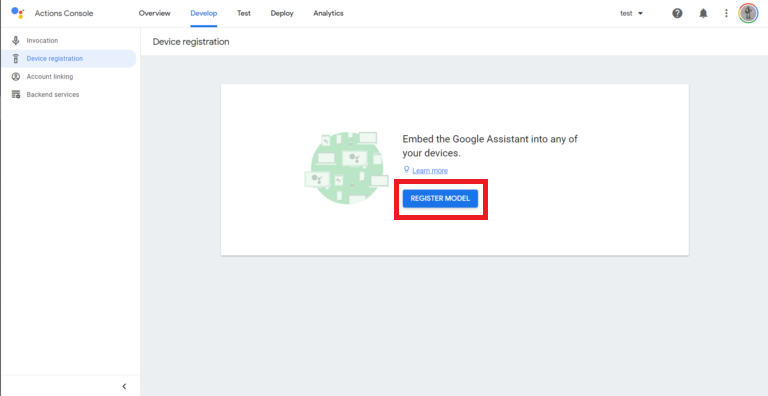

# Python

## Create Google Assistant API
### Access the Google Console: https://console.actions.google.com  
### Add project: Click “Add/import project”


### Click "Are you looking for device registration?"


### Visit https://console.developers.google.com/apis





### Download OAuth 2.0 credentials


### Copy credentials to Raspberry Pi
```
~ $ google-oauthlib-tool --scope https://www.googleapis.com/auth/assistant-sdk-prototype --scope https://www.googleapis.com/auth/gcm --save --headless --client-secrets /home/pi/Downloads/[your client oauth file name].json
```

<!-- ## Create Dialogflow

### Access the Dialogflow: https://dialogflow.cloud.google.com/
### Create Project

### <a href="./dialogflow_settings/speaker.zip" download>Click to Download Dialogflow File</a>

### [Click to Download Dialogflow File](./dialogflow_settings/speaker.zip) -->

## Install
```sh
[Respeaker Setting]
~ $ git clone https://github.com/respeaker/seeed-voicecard.git
~ $ cd seeed-voicecard
~/seeed-voicecard $ sudo ./install.sh
~ $ sudo apt-get update
~ $ sudo apt-get install portaudio19-dev libffi-dev libssl-dev ~ $ libmpg123-dev

[Source Clone and Install Python modules]
~ $ mkdir Hi-Class
~ $ cd Hi-Class
~/Hi-Class $ git clone https://github.com/Hi-Class/Python.git
~/Hi-Class $ cd Python 
~/Hi-Class/Python $ pip3 install -r requirements.txt
```

## Run
```sh
~ $ cd Hi-Class
~/Hi-Class $ cd Python
~/Hi-Class/Python $ python3 main.py
```