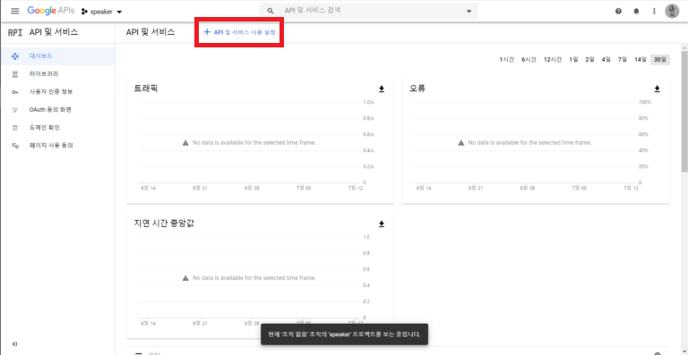
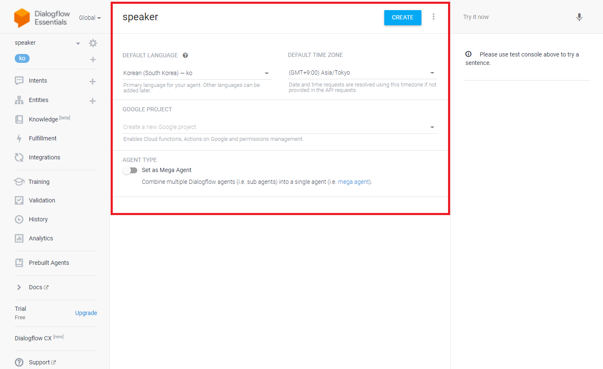

# Python

## Create Google Assistant API
### Access the Google Console: https://console.actions.google.com  
### Add project: Click “Add/import project”


### Click "Are you looking for device registration?"


### Visit https://console.developers.google.com/apis



### Download OAuth 2.0 credentials


### Copy credentials to Raspberry Pi
```sh
~ $ google-oauthlib-tool --scope https://www.googleapis.com/auth/assistant-sdk-prototype --scope https://www.googleapis.com/auth/gcm --save --headless --client-secrets /home/pi/Downloads/[your client oauth file name].json
```

## Create Dialogflow

### Access the Dialogflow: https://dialogflow.cloud.google.com/

### Create Project


### Write like this and press CREATE button


### [Click to Download Dialogflow File](https://github.com/Hi-Class/Python/blob/main/dialogflow_settings/speaker.zip) and Import From ZIP


## Install
```sh
[Respeaker Setting]
~ $ git clone https://github.com/respeaker/seeed-voicecard.git
~ $ cd seeed-voicecard
~/seeed-voicecard $ sudo ./install.sh
~/seeed-voicecard $ sudo apt-get update
~/seeed-voicecard $ sudo apt-get install portaudio19-dev libffi-dev libssl-dev libmpg123-dev

[Source Clone and Install Python modules]
~ $ mkdir Hi-Class
~ $ cd Hi-Class
~/Hi-Class $ git clone https://github.com/Hi-Class/Python.git
~/Hi-Class $ cd Python 
~/Hi-Class/Python $ pip3 install -r requirements.txt
```

## NEIS OPEN API
``` 3. OpenAPI 인증키 발급 ```  
https://open.neis.go.kr/portal/guide/apiGuidePage.do  
paste API KEY to KEY variable
 
```sh
[Setting Neis token, Dialogflow OAuth, Device id]
~ $ cd /Hi-Class/Python/src/speaker
~/Hi-Class/Python/src/speaker $ cp env.py.example env.py
~/Hi-Class/Python/src/speaker $ nano env.py
# Fill all section

# get_meal_schedule
KEY='' # NEIS API KEY
SCHUL_NM='' # School Name

# get_parameter
CREDENTIALS='' # Dialogflow OAuth  
DIALOGFLOW_PROJECT_ID=''

# main
DEVICE_MODEL_ID=''
DEVICE_ID=''
```

## Run
```sh
~ $ cd Hi-Class
~/Hi-Class $ cd Python
~/Hi-Class/Python $ python3 main.py
```